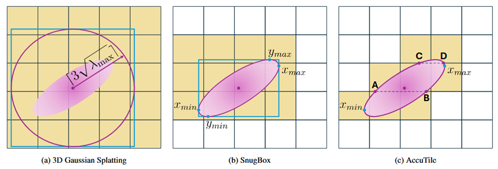
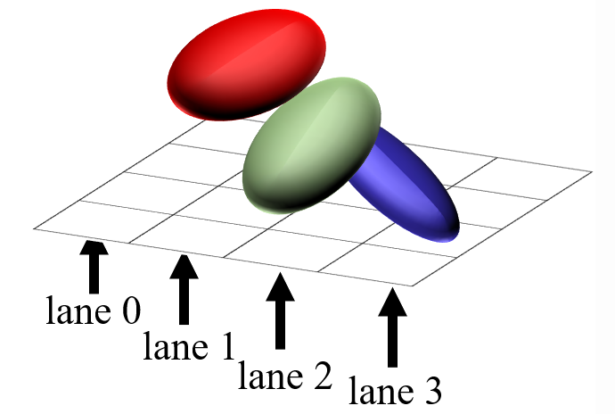
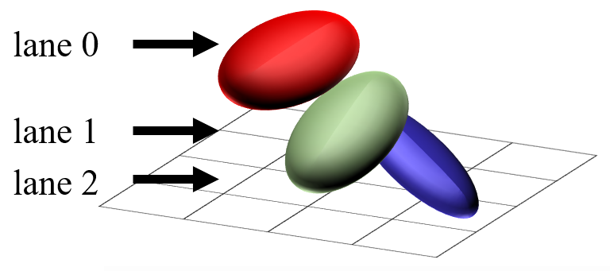
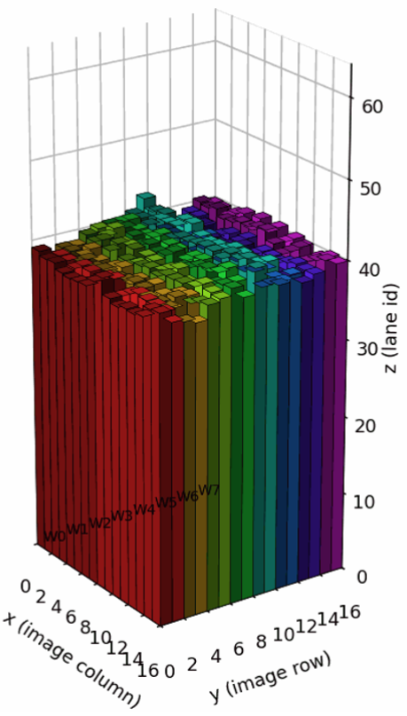
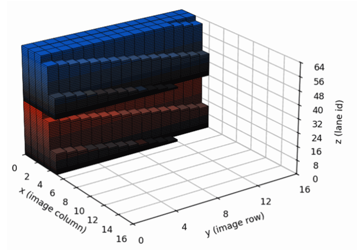
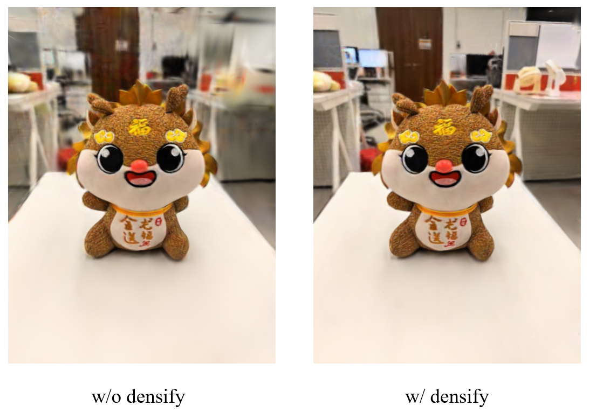
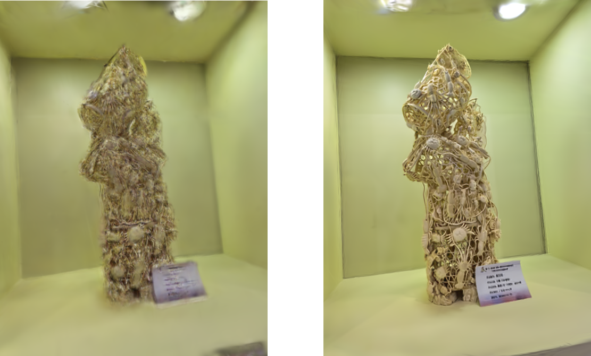

## 0.install && quickly start

### 0.1.install

```bash
conda create -n 3dv_gs python=3.10
conda activate 3dv_gs
pip install torch=xxx torchvision=xxx # 请根据自己的cuda版本选择

pip install -r requirements.txt
```

同时需要下载[AnySplat的权重与配置文件](https://huggingface.co/lhjiang/anysplat/tree/main)到`siggraph_asia/anySplat/ckpt`下

以及[VGGT的权重与配置文件](https://huggingface.co/facebook/VGGT-1B/tree/main)到任意目录下，并在`.vscode/run_all.sh`中，将`VGGY_PATH`的路径改为该下载目录


### 0.2.quicikly start

将`run_all.sh`中的

```
chmod +x .vscode/run_all.sh
./.vscode/run_all.sh
```


## 1.Methods

### 1.1Forward->Tighter BBox

在原版3DGS的方法中，我们借鉴了speedy-splat的解析前向法：



​                  图一：Tighter BBox示意图


给定2D椭圆参数$Cov2D=\{a,b,c\}$，以及椭圆的质心$\mu$和椭球的不透明度$o$，椭圆参数化方程可描述为
<br>

$2\ln(255\cdot o)=t=ax_d^2+2bx_dy_d+cy_d^2$

<br>
并根据极值点方程$\partial{y_d}/\partial{x_d}=0$可求得$x$轴与$y$轴和椭圆的切点$x_{min}$/$x_{max}$，$y_{min}/y_{max}$，从而获得紧凑的`bounding box`（图1中的`SnugBox`）：

<br>

$y_{min/max}=\frac{-bx_d\pm\sqrt{(b^2-ac)x_d^2+tc}}{c},\;\;\;x_d=\pm\sqrt{\frac{b^2t}{(b^2-ac)a}}$

<br>

随后，在`SnugBox`所占据的`rectangle tiles`中，我们遍历列`tiles`，并根据列`tile`的左右边界坐标（e.g. $x=x_{tmin},\;\;x=x_{tmax}$）闭式计算出与椭圆的交点，从而确定该列有哪些`tile`与椭圆相交，并顺序写入`tile id`和`depth value`。


### 1.2.Backward->Per-Gaussian parrarelization

Taming-GS提出使用per-Gaussian而不是per-pixel的反向传播策略。具体来说，传统的3DGS在反向传播时每个线程负责一个像素，并顺序遍历叠在该像素上的所有高斯，并对梯度进行原子加法，这在不同线程中会引起严重的竞态。在一般场景中，一个tile上往往叠加了几百个splats，这也会使得并行数（256）小于顺序遍历数。而Taming-GS提出每个线程负责一个splat，计算完当前tile所有像素对于该splat的梯度贡献后再进行原子加法，大大减小了线程竞态；

     

图二：per-gaussian 反向传播示意图


我们在前向渲染时，**每个像素**每渲染32个splats记录一次反向传播时所需的透射率`T`和所blending的颜色`C`，从而在反向传播时，每个warp可以独立地对自己组内的splat递归更新梯度，如图3（右）所示，不同颜色表示不同的warp，每个warp根据前向时所记录的`T`和`C`在warp内遍历当前tile所有像素，递归更新每个splat的梯度

                

图三：per-gaussian 反向传播示意图


将`Forward`与`Backward`结合，我们在TNT数据集上测试了训练时长（30000轮迭代），同时我们也比较了在`duplicateWithKeys`过程中使用`LOAD BALANCING`的时长：

| **TNT /s (4090)**                    | **Barn** | **Truck** | **Ignatius** | **Meeting** | **Caterp** |
| :----------------------------------- | :------: | :-------: | :----------: | :---------: | :--------: |
| 3DGS (baseline)                      |   638    |    611    |     618      |     574     |    615     |
| w/ Backward                          |   191    |    173    |     181      |     145     |    183     |
| w/ Backward & Forward                |   180    |  **159**  |   **173**    |   **137**   |  **171**   |
| w/ Backward & Forward & Load Balance | **176**  |    163    |     177      |     141     |    171     |

### 1.3.Representation->Neural Gaussians

应用了1.1和1.2中的加速方法之后，我们发现在4090上仍然没法在1min中内完成收敛，哪怕提前截止（20000轮），时间也在1min开外，因此我们打算更改表达方式进行加速。

我们分析，由于在原本的表达中，每个splat为一个单独的叶子节点，这使得每个splat并不能共享优化信息，使得优化效率低下。为此我们引入了`Scaffold-GS`作为表达，使用`anchor`的特征来inference `splats`的属性，这大大减少了优化参数数量，并使得收敛更快。


图四：scaffold-GS（左）和vanilla-GS（右）对比图


### 1.4.Feedforward Initial Points

我们使用了AnySplat的输出点位置，降采样后作为初始的`anchor`位置，



图五：稠密化初始点（左）与不稠密化（右）对比图

**需要注意一点，anySplat和VGGT并不是必须的，使用轻量的深度估计模型增加初始点数量也是可行的**

### 1.5.Pose Optimization

由于数据集的位姿十分不准确，我们进行了位姿优化




图六：使用位姿优化（右）与不使用位姿优化（左）对比图

**由于没有测试集的准确位姿，我们仅评估训练集的PSNR**

## 2.测试结果


