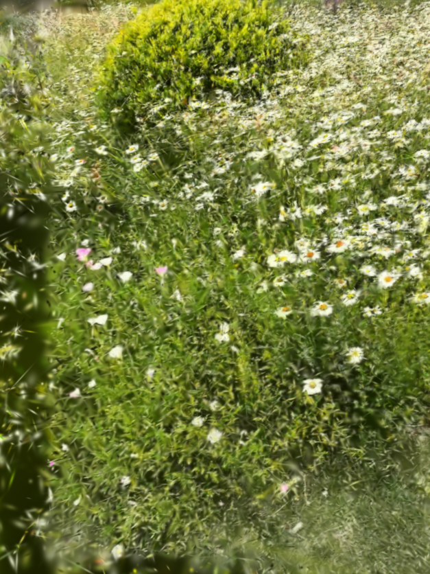

本版主要包含了
> 1.speedy-splat的前向（更紧凑的bbox）

> 2.taming-gs的反向（renderCUDA中per-gaussian的并行）

> 3.scaffold-GS表达（加速收敛）

> 4.位姿优化（monoGS优化策略）

> 5.metric3D用于添加初始高斯点云，metric3D需要另外下[权重](https://huggingface.co/JUGGHM/Metric3D/resolve/main/metric_depth_vit_giant2_800k.pth?download=true)到`metric3D/weight`目录下

比赛要求30s~60s内重建完整个场景，评测时使用全分辨率，在4090上测。初赛ddl是**October 25, 2025**，复赛ddl是**November 15, 2025**。给定的数据包含colmap格式的sfm结果和视频以及时间戳与colmap-image_id的对应关系

使用单目深度模型预先预测深度包含在预处理时间内，并不属于重建时间。但如果要重跑colmap，colmap的特征提取、匹配、ba都属于重建时间。官方具体回复意见如下：
```
1.Currently, we do not have an official consultation group for the challenge. All official announcements and updates will be communicated through our website. Please check it regularly for the latest information.

2.Participants are required to submit their complete source code. This should be accompanied by a Conda environment file (environment.yml) and a clear setup documentation file (e.g., README.md) explaining how to configure the environment and run the code. All evaluations will be conducted on our standard testing platform: a single NVIDIA GeForce RTX 4090 Ti GPU with Ubuntu 22.04. The evaluation will be conducted using the original full resolution of the provided images.
3.The 60-second time limit specifically refers to the reconstruction part only - that is, the computation time from the input set of images to the final .ply output. This timing does not include data loading and image pre-processing, and saving the .ply output.
4.Regarding camera pose refinement: You are permitted to re-run SfM or perform other pose optimization as part of your preprocessing. However, please note that:
a.The computational time required for this process will be included in the 60-second reconstruction time limit
b.You must provide the reconstructed SfM point cloud and corresponding camera pose files with your submission
```


各路环境都在environment.yaml中，包括需要本地安装的cuda kernel。运行脚本可以使用`.vscode/run.sh`，需要更换数据集路径。数据集在[此处下载](https://cuhko365-my.sharepoint.com/personal/218012028_link_cuhk_edu_cn/_layouts/15/onedrive.aspx?id=%2Fpersonal%2F218012028%5Flink%5Fcuhk%5Fedu%5Fcn%2FDocuments%2FGAP%2FFinal%2Erar&parent=%2Fpersonal%2F218012028%5Flink%5Fcuhk%5Fedu%5Fcn%2FDocuments%2FGAP&ga=1)，但是我下下来.rar只能解压部分，在不同设备上都是如此。


目前重建流程在4090上重建结果限制在8000iter以内的话可以做到1min重建，psnr测了几个场景大概能到20（室外低很多，16,13都有可能），但其实看样子是重建的差不多了的，比如左不使用scaffold，右使用scaffold（两者高斯点云都是10w，psnr只差了0.3）


 


感觉初赛用这个应该能拱进复赛，现阶段还差流程标准化：<br>
>1.full evaluate的评测脚本；<br>
2.由于比赛要求提供30s重建时的指标，因此需要在训练中加一个计时器，当训练到达30s时停止迭代且停止计时，eval一下输出结果再继续训练继续计时。<br>
3.重建到达60s时强制停止，并保存`.ply`+eval<br>
4.4页技术报告


复赛可能需要加的：<br>
(1)radsplat的pruing策略<br>
(2)根据render图像和gt图的差异，差异大的地方通过渲染深度反投影三维点作为新添加的高斯点<br>
(3)使用`topK densify` + splat数量schedule控制anchor数目增长